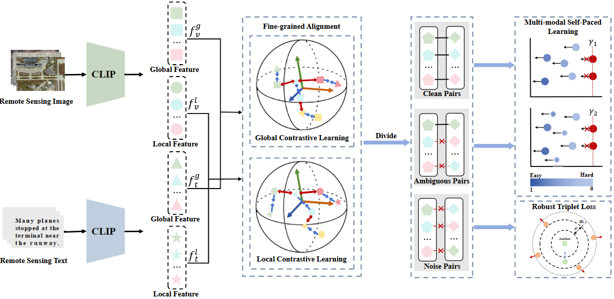
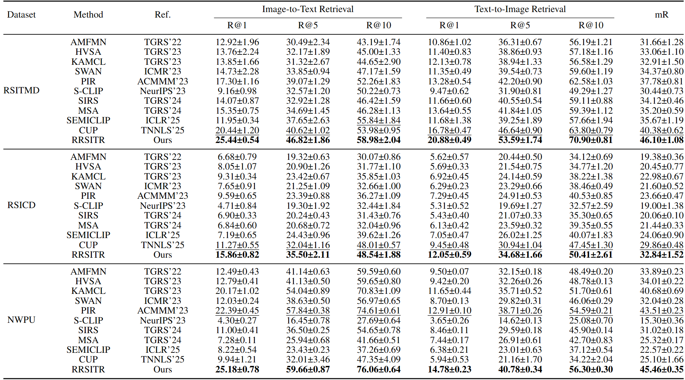
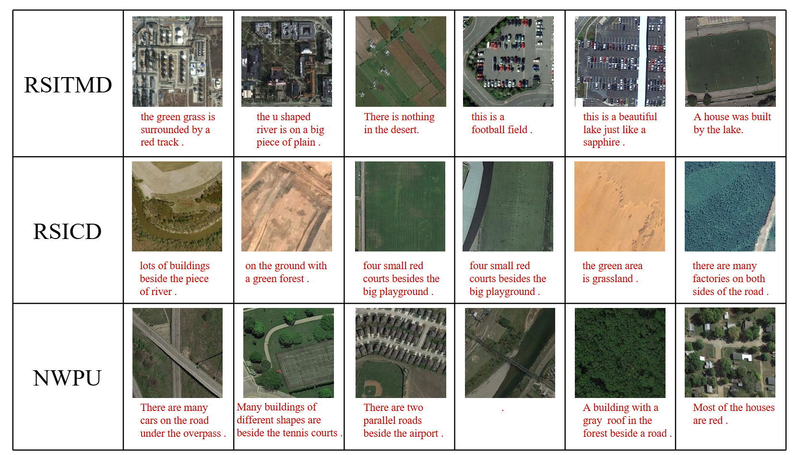

# [CVPR 2026] Robust Remote Sensing Image–Text Retrieval with Noisy Correspondence

## Abstract
As a pivotal task that bridges remote visual and linguistic understanding, Remote Sensing Image-Text Retrieval (RSITR) has attracted considerable research interest in recent years. However, almost all RSITR methods implicitly assume that image-text pairs are matched perfectly. In practice, acquiring a large set of well-aligned data pairs is often prohibitively expensive or even infeasible. In addition, we also notice that the remote sensing datasets (e.g., RSITMD) truly contain some inaccurate or mismatched image text descriptions. Based on the above observations, we reveal an important but untouched problem in RSITR, i.e., Noisy Correspondence (NC). To overcome these challenges, we propose a novel Robust Remote Sensing Image–Text Retrieval (RRSITR) paradigm that designs a self-paced learning strategy to mimic human cognitive learning patterns, thereby learning from easy to hard from multi-modal data with NC. Specifically, we first divide all training sample pairs into three categories based on the loss magnitude of each pair, i.e., clean sample pairs, ambiguous sample pairs, and noisy sample pairs. Then, we respectively estimate the reliability of each training pair by assigning a weight to each pair based on the values of the loss. Further, we respectively design a new multi-modal self-paced function to dynamically regulate the training sequence and weights of the samples, thus establishing a progressive learning process. Finally, for noisy sample pairs, we present a robust triplet loss to dynamically adjust the soft margin based on semantic similarity, thereby enhancing the robustness against noise. Extensive experiments on three popular benchmark datasets demonstrate that the proposed RRSITR significantly outperforms the state-of-the-art methods, especially in high noise rates. 

## Method




## Environment

```
conda create -n rrsitr python=3.10.12
conda activate rrsitr
pip install -r requirements.txt
```

## Dataset

The directory structure for the datasets is organized as follows:

```
Path/To/precomp
├─ rsitmd
│  ├─ RSITMD-NC-00.csv # noise ratio 0%
|  ├─ RSITMD-NC-02.csv # noise ratio 20%
|  ├─ RSITMD-NC-04.csv # noise ratio 40%
│  ├─ RSITMD-NC-06.csv # noise ratio 60%
│  ├─ RSITMD-NC-08.csv # noise ratio 80%
│  ├─ rsitmd_val.csv   # Validation set
│  └─ rsitmd_test.csv  # Test set
└─ ......
```

## Usage

### Training

Use the provided training script:

```bash
# Training on RSITMD dataset
bash train_rsitmd.sh

```

### Evaluation

```bash
# Evaluation script
bash test_rsitmd.sh

```

## Citation

If this project helps your research, please cite our paper:

```
@misc{song2026robustremotesensingimagetext,
      title={Robust Remote Sensing Image-Text Retrieval with Noisy Correspondence}, 
      author={Qiya Song and Yiqiang Xie and Yuan Sun and Renwei Dian and Xudong Kang},
      year={2026},
      eprint={2603.28134},
      archivePrefix={arXiv},
      primaryClass={cs.CV},
      url={https://arxiv.org/abs/2603.28134}, 
}
```

## Acknowledgement
We base the RRSITR code on the implementation of EBAKER. We thank the authors of the [EBAKER](https://github.com/mcx-mcx/EBAKER) for making their code available to the public.

## Comparison with the State-of-the-Art

Image-text retrieval performance on RSITMD, RSICD, and NWPU under 0% noise ratio.



## Visualization of Noisy Sample Pairs

Some noisy sample pairs correctly identified by RRSITR.



